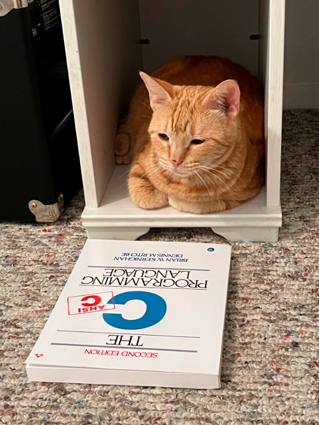

###### git-lesson-05-10

# Homework
## Оформление текста

*Курсив* - выделение текста (*) или (_);

**Жирный** - выделение текста (**) или (__);

~~Зачеркнутый~~ - выделение текста (~~);

***Жирный курсив*** - выделение текста (***) или (___);

> Цитата - перед текстом поставить (>);

## Нумерация сторок

Неупорядоченный список: 
\
(перед пунктом ставим (*), (+), (-))

* Пункт 1
+ Пункт 2
- Пункт 3

Упорядоченный список:
\
(перед пунктом нумеруем цифрами)
1. Пункт 1
2. Пункт 2
3. Пункт 3

## Работа с фотографиями

Для того, чтобы вставить фото:
\
" ![текст замещающий отсутствие фото] 
(название фото, которое лежит в корне папки, с расширением)"

После добавления фото, лучше создать файл (.gitignore), и поместить её туда. В ней просто в строке вписываем название фото с расширением. Это нужно для того, чтоб не инициализировать постоянно фото. Но также нужно инициализировать (add) файл .gitignore

## Работа с ссылками

Для использования ссылок пришем:
\
[] - в них пишем слово с гиперссылкой;
\
() - в них вставляем ссылку

Пример:

1. [...] без пробела (https://.../)
\
2. [Link](https://gb.ru/)

## Работа с GitHub'ом и удаленным репозиторием

1. Делаем Форк (fork) интересуещего нас репозитория.
2. Мы делаем git clone для нашей версии этого репозитория.
3. Мы создаем ветку с предлагаемыми изменениями.
4. Производим все изменения только в этой ветке.
5. Отправляем это изменения на свой аккаунт (push).
6. В окне на ГитХаб появляется возможность отправить pull request.  

---

1. Создали аккаунт на ГитХаб
2. Создать локальный репозиторий
3. "Подружить" ваш локальный и удаленный репозиторий. ГитХаб при создании нового репозитория подскажет как это можно сделать.
4. Отправить (push) ваш локальный репозиторий в удаленный (на ГитХаб), при этом вам, возможно, нужно будет авторизоваться на удаленном репозитории.
5. Привести изменения "с другого компьютера".
6. Выкачать (pull) актуальное состояние из удаленного репозитория. 

## Полезные команды для работы с Git'ом

**cd** - Переместиться внутрь папки

**cd..** - Переместиться из папки

**mkdir** -Создать новую папку

**ls** - Посмотреть список файлов в папке

**new-item** - Создать новый файл

**git branch** - Проверить список существующих веток

**git branch branch_name** - Создать ветку с названием branch_name

**git checkout branch_name** - Переместиться на ветку с названием branch_name

**git checkout -b branch_name** - Создать ветку с названием branch_name и сразу переместиться в неё

**git branch -d branch_name** - Удалить ветку с названием branch_name (в случае если мы слили эту ветку)

**git branch -D branch_name** - Удалить ветку с названием branch_name принудительно (даже без слияния её с другой)

**git merge branch_name** - Слить ветку branch_name в ветку в которой сейчас находимся

**git init** - Инициализация репозитория

**git add "file_name"** - Добавить файлу с названием "file_name" версионность

**git add .** - Добавить всем файлам в папке версионность

**git reset .** - Убрать у всех файлов в папке версионность

**git reset "file_name"** - Убрать у файла "file_name"  версионность

**git commit -m "commit_massage"** - Упрощенный вариант ввода коммита

**git commit** - Обычный вариант коммита

**git commit -am "second_commit"** - Если файл имеет состояние "modified" (т.е. был  tracked ранее и мы его добавили с помощью "git add"), то можно пропустить этап с командой "git add" посредством использования данной команды

**git checkout "hash_number"** - Переместить на коммит с хэшем "hash_number" (для того, чтобы вернуться "git checkout master/main)

**git diff** - Последние изменения (начиная с коммита)
