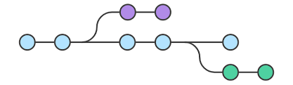

Инструкция (конспект) по работе с git
==================

# lesson 1. Команды git. 

> Всего несколько команд нужно для базового варианта использования Git для ведения истории изменений.

Ссылка на [семинар](https://gb.ru/lessons/368493 "Lesson1")

---
_Для начала нам понадобиться эта команда, чтобы инициализировать репозиторий в нужной нам папке:_

**git init** - иннициализация репозитория в конкретной папке

---
_Теперь запомним команды для добавления и удаления файлам версионности:_

**git add "file_name"** - добавить файлу с названием "file_name" версионность

**git add .** -добавить всем файлам в папке версионность

**git reset .** - убрать всем файлам в папке версионность

**git reset "file_name"** - удалить у файла "file_name" версионность

---
_Теперь рассмотрим коммиты:_

**git commit** - обычный вариант коммита (сложен в использовании)

> Команда git commit делает для проекта снимок текущего состояния изменений, добавленных в раздел проиндексированных файлов. Такие подтвержденные снимки состояния можно рассматривать как «безопасные» версии проекта — Git не будет их менять, пока вы явным образом не попросите об этом. Перед выполнением команды git commit необходимо использовать команду git add, чтобы добавить в проект («проиндексировать») изменения, которые будут сохранены в коммите. Эти две команды, git commit и git add, используются чаще всего.

**git commit -m "commit_message"** - упрощенный вариант ввода коммита

> Быстрая команда, которая создает коммит с указанным комментарием. По умолчанию команда git commit открывает локально настроенный текстовый редактор с предложением ввести комментарий к коммиту. При передаче параметра -m текстовый редактор не открывается, а используется подставленный комментарий.

**git commit -a** - выполнение коммита для уже отслеживаемого файла

> Выполнение коммита состояния со всеми изменениями в рабочем каталоге. Эта команда включает только изменения отслеживаемых файлов (тех, которые были в какой-то момент добавлены в историю с помощью команды git add).

**git commit -am "commit_message"** - если файл имеет состояние modify (т.е. был tracked ранее и мы его добавили с помощью  git add), то можно пропустить этап с командой git add посредством использования данной команды

> Команда для опытных пользователей с параметрами -a и -m. Эта комбинация параметров создает коммит всех проиндексированных изменений и добавляет к коммиту подставленный комментарий.

**git commit --amend** - добавление изменений в предыдущий коммит

> Этот параметр добавляет команде commit новый уровень функциональности. При передаче этого параметра будет изменен последний коммит. Вместо создания нового коммита проиндексированные изменения будут добавлены в предыдущий коммит. Кроме того, эта команда откроет настроенный текстовый редактор системы с предложением изменить указанный ранее комментарий к коммиту.

---
_Научимся перемещаться между коммитами:_

**git checkout "hash_numder"** - переместиться на коммит с хэшем "hash_numder"

**git checkout "master"**, **git checkout "main"** - вернуться на последний коммит основной ветки (main/master)

---
_И еще две полезные команды, которые нам обязательно пригодятся:_

**git diff** - отображает последние изменения (начиная от последнего коммита)

> Сравнение — это функция, анализирующая два входных набора данных и отображающая различия между ними. git diff представляет собой многоцелевую команду Git, которая инициирует функцию сравнения источников данных Git — коммитов, веток, файлов и т. д. В этом документе описываются типичные варианты вызова git diff и схемы рабочего процесса сравнения. Зачастую вместе с командой git diff используются git status и git log для анализа текущего состояния репозитория Git.

**git status** - проверка статуса

> Команда git status отображает состояние рабочего каталога и раздела проиндексированных файлов. С ее помощью можно проверить индексацию изменений и увидеть файлы, которые не отслеживаются Git. Информация об истории коммитов проекта не отображается при выводе данных о состоянии. Для этого используется команда git log.

---

# lesson 2. Команды git

Ссылка на [семинар](https://gb.ru/lessons/368494 "Lesson2")

_Очистим все лишнее в окне терминала:_

**clear** - очистить лог (расчистим себе пространство)

---
_Вспомним несколько полезных комманд для создания/удаления файлов/папок, перемещения между папками и отображения файлов в папках:_

**cd "folder_name""** - перемещение в папку 

**cd ..** - вернуться на один уровень назад

**new-item "new_file_name"** (только для терминала повершелл) - позволяет создавать новые файлы в хранилище

**mkdir "new_folder_name"** - позволяет создавать папки

**ls** - отображает список всех файлов, которые находятся в данной папке

---
_Для отображения наших коммитов можем использовать:_

**git log** - отображает все наши коммиты

> Команда git log отображает отправленные снимки состояния и позволяет просматривать и фильтровать историю проекта, а также искать в ней конкретные изменения. С помощью git status можно просматривать рабочий каталог и раздел проиндексированных файлов, в то время как git log показывает только историю коммитов.

**git log --graph** - иной способ отображения коммитов

> Здесь содержится несколько полезных параметров: флаг --graph создает основанную на тексте диаграмму коммитов в левой части области сообщений коммитов; флаг --decorate добавляет отображаемые имена веток или теги коммитов; флаг --oneline записывает информацию о коммите в одну строку, что позволяет без труда просматривать множество коммитов сразу.

---
_Теперь о ветках:_

**git branch** - проверить список существующих веток

**git branch "branch_name"** - создать ветку с названием "branch_name"

**git checkout "branch_name"** - переместиться на ветку с названием "branch_name"

**git checkout -b "branch_name"** - добавить новую ветку и переместиться в неё

**git merge "branch_name"** - слить в текущую ветку изменения из "branch_name"

**git branch -D "branch_name"** - удалить еще не слитую ветку "branch_name"

**git branch -d "branch_name"** - удалить уже слитую ветку "branch_name"

---

**.gitignore** - добавляем в этот файл файлы, которые не будем отслеживать

> Игнорируемые файлы отслеживаются в специальном файле .gitignore, который регистрируется в корневом каталоге репозитория. В Git нет специальной команды для указания игнорируемых файлов: вместо этого необходимо вручную отредактировать файл .gitignore, чтобы указать в нем новые файлы, которые должны быть проигнорированы. Файлы .gitignore содержат шаблоны, которые сопоставляются с именами файлов в репозитории для определения необходимости игнорировать эти файлы.

# lesson 2. Команды для работы с удалёнными репозиториями

Ссылка на [семинар](https://gb.ru/lessons/368495 "Lesson3")

## Цикл работы локальный-удаленный репозиторий:

_Удаленный репозиторий, к которому у нас есть доступ, можно скопировать (клонировать) на локальный:_

0. **git clone "url"** - позволяет скопировать файлы с удаленного репозитория, расположенного по ссылке "url" (делает копию удаленного репозитория)

___
_И наоборот - с локального репозитория загрузить на  [Github.com](https://github.com/ "Github.com") или другой сервис для организации работы удаленных репозиториев:_

1. **git init** - cоздаем локальный репозиторий с помощью команды

2. Создаем новый файл в локальном репозитории. Например, file_name.md.

3. **git add '.\file_name'** - добавляем файл к отслеживанию

4. ***git commit -m "Initial commit"** - создаем коммит

5. С помощью подсказки от github.com вводим команды, например:

* git remote add origin https://github.com/login_github/repo_name.git (login_github - имя аккаунта на github.com, repo_name - название репозитория, клон которого хотим сделать, origin - название ?)

* git branch -M main (main - выбор ветки)

* git push -u origin main

6. **git status** - проверяем статус

---

_Последующие изменения можно загружать так:_

7. Вносим в файл какие-нибудь изменения.

8. **git add '.\file_name'** - добавляем файл с изменениями к отслеживанию

9. ***git commit -m "Комментарий к коммиту"** - создаем коммит

10. **git status** - проверяем статус, убеждаемся, что все правильно

11. **git push** - направляем файл на удаленный репозиторий (требует авторизации на удаленном репозитории)

---

_Если ожидается изменения от другого пользователя:_

12. **git pull** - подгружаем изменения (не только выкачивает изменения, но и сливает их. может потребоваться разрешение конфликта)

13. **git log** - проверяем логи

---

## Как сделать pull request

1. Делаем форк (fork) интересующего нас проекта

2. Делаем git clone для нашей версии этого репозитория

3. Создаем ветку с предлагаемыми изменениями. Производим все изменения только в этой ветке

4. Фиксируем изменения (делаем коммиты)

5. Отправляем изменения на свой аккаунт (push)

6. После этого на Github появляется возможность отправить pull request

---

# Полезные ссылки и материалы:

[Git для новичков (часть 1)](https://habr.com/ru/articles/541258/ "Git для новичков (часть 1)")

[Git для новичков (часть 2)](https://habr.com/ru/articles/542616/ "Git для новичков (часть 2)")

[Книга “Git для профессионального программиста”](https://gbcdn.mrgcdn.ru/uploads/asset/4245110/attachment/d4eb8c232f8f2bdf4e42ba7cb49e0c50.pdf "Книга Git для профессионального программиста")

[Статья про папки, репозитории и некоторые сложности при освоении контроля версий от Ильнара Шафигуллина”](https://gb.ru/posts/soveti-pro-git "Статья про папки, репозитории и некоторые сложности при освоении контроля версий от Ильнара Шафигуллина")

[Как использовать git правильно](https://vimeo.com/showcase/5616060 "Как использовать git правильно")

[Cкринкаст от Ильи Кантора](https://vimeo.com/showcase/5616060 "скринкаст от Ильи Кантора")

__На этом всё, спасибо за внимание!__
